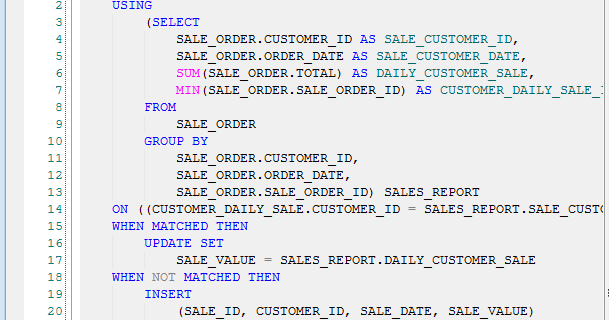

# Writing SQL queries

SQL, or Structured Query Language, is a language designed to allow both technical and non-technical users to query, manipulate, and transform data from a relational database. Due to its simplicity, SQL databases provide safe and scalable storage for millions of websites and mobile applications.

# Why use it?

The beauty of SQL is that anyone working at a company that stores data in a relational database can use it. 

For example:

* Companies that want to pull data on their customers does it using SQL. 
* If you work for an ecommerce company that has data about customer purchases, you can use SQL to find out which customers are purchasing which products. Of course, these are just a few of many, many examples.

## How to write simple SQL queries

Lets learn how to write a simple SQL query, using the following example:

__*Who are the people who have red hair in Massachusetts and were born in 2003 organized in alphabetical order?*__

1. It begins with SELECT which SELECT which chooses the fields that you want displayed in your document.

SELECT
  - first_name
  - last_name

2. FROM - pinpoints the table you want to pull the dat from.

  SELECT
    - first_name
    - last_name
  FROM
    - people_massachussets

3. WHERE - allows you to filter your query to be more specific
    - hair_color = "red"

4. AND - allows you to ad additional criterias
    - birth_date BETWEEN '2003-01-01' AND '2003-12-31'
5. ORDER BY - allows you to sort by any of the fields that you have specified in the SELECT statement.

So the SQL query is as follows: 

Here is our SQL query:

SELECT
     first_name,
     last_name
FROM
     people_massachusetts
WHERE
     hair_color = "red"
AND
     birth_date BETWEEN '2003-01-01' AND '2003-12-31'
ORDER BY
     last_name
;

Hre's an example of what a real SQL query statement looks like

Reference

1. https://www.sqlbolt.com
1. https://blog.hubspot.com/marketing/sql-tutorial-introduction