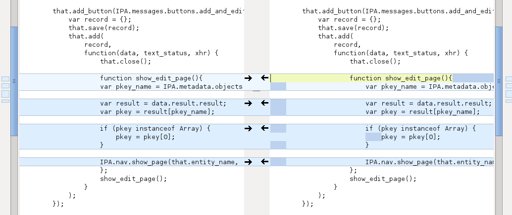

# Functional Programming Concepts and Refactoring Javascript for Readability

**What is functional programming?**

Functional programming is a programming paradigm — a style of building the structure and elements of computer programs — that treats computation as the evaluation of mathematical functions and avoids changing-state and mutable data.

The first fundamental concept we learn when we want to understand functional programming is pure functions. But what does that really mean? What makes a function pure?

* It returns the same result if given the same arguments
* It does not cause any observable side effects

**Advantages**

* Pure functions don’t change any states and are entirely dependent on the input, they are simple to understand. T
* Pure functions avoid changing variables or any data outside it therefore implementing concurrency becomes efficacious.
* It supports the concept of lazy evaluation, which means that the value is evaluated and stored only when it is required.
* Pure functions take arguments once and produce unchangeable output. They use immutable values, making debugging and testing easier.
* It's style treats functions as values and passes the same to other functions as parameter.
* It enhances the comprehension and readability of the code.

Here's an example of the code refactoring process

**Disadvantages**

* Immutable values combined with recursion might lead to a reduction in performance
* In some cases, writing pure functions causes a reduction in the readability of the code
* Though writing pure functions is easy, combining the same with the rest of the application as well as the I/O operations is tough
* Writing programs in recursive style in place of using loops for the same can be a daunting task

**Refactoring javascript turns bad code into good code**

* Refactoring Code is the process of changing a program’s source code without modifying its external functional behavior, to improve some of the nonfunctional attributes of the software.
* Basically it means, re-writing it so that it will be easier to read, understand and easily adapt to changes in the future.
* Behavior of the system SHOULD NOT get changed.
* Code Refactoring also helps us to cut down the size of the code.

References

1. https://en.wikipedia.org/wiki/Functional_programming 
1. https://hackr.io/blog/functional-programming#:~:text=Functional%20programming%20is%20a%20programming,the%20imperative%20style%20of%20programming
1. https://medium.com/javascript-in-plain-english/refactoring-code-in-javascript-695b42eea1a5
