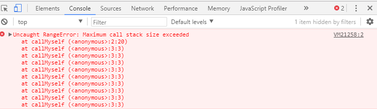

# The Call Stack defined on MDN

A call stack is a mechanism for an interpreter (like the JavaScript interpreter in a web browser) to keep track of its place in a script that calls multiple functions — what function is currently being run and what functions are called from within that function, etc.

1. When a script calls a function, the interpreter adds it to the call stack and then starts carrying out the function.
1. Any functions that are called by that function are added to the call stack further up, and run where their calls are reached.
1. When the current function is finished, the interpreter takes it off the stack and resumes execution where it left off in the last code listing.
1. If the stack takes up more space than it had assigned to it, it results in a "stack overflow" error.

## Example

function greeting() {
   // [1] Some code here
   sayHi();
   // [2] Some code here
}
function sayHi() {
   return "Hi!";
}

// Invoke the `greeting` function
greeting();

// [3] Some code here

## explanation

1. When the greeting() function is  invocated. It is added to the call stack list.
1. The code inside the greeting() function is executed.
1. The sayHi() function is invocated.
1. The sayHi() function is added to the call stack list.
1. The code inside the sayHi() function is executed.
1. The sayHi() and continue executing the rest of the greeting() function.
1. The sayHi() function is deleted from our call stack list
1. When everything inside the greeting() function has been executed, return to its invoking line to continue executing the rest of the JS code.
1. The greeting() function is deleted from the call stack list.
1. The call stack list is now empty.

# Understanding the JavaScript Call Stack

Essentially, a call stack is a data structure that uses the Last In, First Out (LIFO) principle to temporarily store and manage function invocation (call).

# JavaScript error messages

__What causes a stack overflow?__

A stack overflow occurs when there is a recursive function (a function that calls itself) without an exit point. The browser (hosting environment) has a maximum stack call that it can accomodate before throwing a stack error. Hwer's aan example of a stack overflow.

This code will run until the browser gives an error:

function callMyself(){
  callMyself();
}
callMyself();

__References__

1. https://developer.mozilla.org/en-US/docs/Glossary/Call_stack
1. https://www.freecodecamp.org/news/understanding-the-javascript-call-stack-861e41ae61d4/
1. https://www.freecodecamp.org/news/understanding-the-javascript-call-stack-861e41ae61d4/