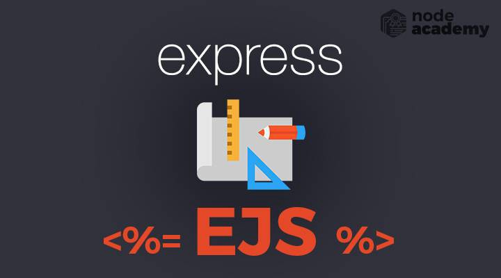

# What is EJS? 

EJS is a simple templating language that lets you generate HTML markup with plain JavaScript. In my plain terms EJS stands for "Easy JavaScript".

Here's an example of how to use EJS to use EJS to include repeatable parts of a site (partials) and pass data to the front end.

**ESJ tags**

ESJ uses these tags:

* **<% 'Scriptlet' tag** - for control-flow, no output
* **<%_ ‘Whitespace Slurping’** - Scriptlet tag, strips all whitespace before it
* **<%=** - Outputs the value into the template (HTML escaped)
* **<%-** - Outputs the unescaped value into the template
* **<%# Comment tag** - no execution, no output
* **<%%** - Outputs a literal '<%'
* **%>** - Plain ending tag** 
* **-%> Trim-mode ('newline slurp') tag** - trims following newline
* **_%> 'Whitespace Slurping’** - ending tag, removes all whitespace after it

**Steps to creating a template using EJS**

1. Install EJS with NPM install
1. create a file strucure with these files:
   * views
   * partials
   * footer.ejs
   * head.ejs
   * header.ejs
   * pages
   * index.ejs
   * about.ejs
   * package.json
   * server.js
1. Set up your node in the the package.json file with these requiremens:

    * "name": "node-ejs",
    * "main": "server.js",
    * "dependencies":
    * "ejs": "^3.1.5",
    * "express": "^4.17.1"
      
1. configure dependencies within the server.js file:
  * Define application by loading Express, etc.
  * Setting the view engine to EJS
  * Set res.render() to load the view file
  * This an example code for rendering a page:

    app.get('/about', function(req, res) {
      res.render('pages/index');
    }

References

1. https://www.digitalocean.com/community/tutorials/how-to-use-ejs-to-template-your-node-application
1. https://www.youtube.com/watch?v=63IurQvsw9w&list=PL7sCSgsRZ-slYARh3YJIqPGZqtGVqZRGt&index=2
1. https://ejs.co/#:~:text=EJS%20is%20a%20simple%20templating,It's%20just%20plain%20JavaScript.