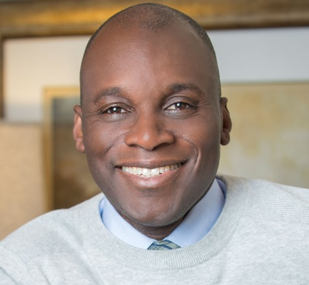

# Welcome to Clement Buchanan's Github page

 

Let me tell you a little bit about me. I'm a really nice guy but to know me is to really know me. I love my life, my family and coding. I learned to code at CodeFellows. It's a great place to learn software development.

### Table of Contents

1. [Code 102 Reading Notes](README.md)
    1. [My first day of training](training.md)
    1. [About Git](about_git.md)
    1. [About HTML](html.md)
    1. [About growth mindset](mindset.md)
    1. [About chosing a WYSIWYG editor](wysiwyg.md)
    1. [About Cascading Style Sheets](css.md)
    1. [Icons of Reggae Music](https://clementbuchanan.github.io/music)
1. [Code 201 Reading Notes](code201Notes.md)
    1. [About Me](aboutMe.html)
    1. [Class 01](code201Class01.md)
    1. [Class 02](code201Class02.md)
        - [Lab 02](https://clementbuchanan.github.io/201project/)
    1. [Class 03](code201Class03.md)
    1. [Class 04](code201Class04.md)
    1. [Class 05](code201Class05.md)
    1. [Class 06](code201Class06.md)
    1. [Class 07](code201Class07.md)
        - [Lab 07]()
    1. [Class 08](code201Class08.md)
        - [lab 08](lab08.md)
    1. [Class 09](code201Class09.md)
        - [Lab 09](lab09.md)
    1. [Class 10](code201Class10.md)
        - [lab 10a](Lab10a.md)
        - [lab 10b](Lab10b.md)
        - [lab 10c](Lab10c.md)
    1. [Class 11](code201Class11.md)
        - [lab 11](lab11.md)
    1. [Class 12](code201Class12.md)
        - [lab 12](lab12.md)
    1. [Class 13](code201Class13.md)
        - [lab 13](lab13.md)
    1. [Class 14](code201Class14.md)
        - [lab 14a](lab14.md)
        - [lab 14b](lab14b.md)
    1. [Class 15](code20Class15.md)
        - [lab 15a](lab15a.md)
        - [lab 15b](lab15b.md)