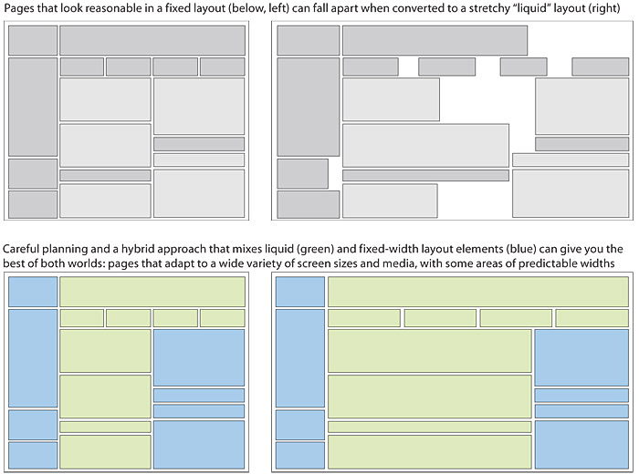
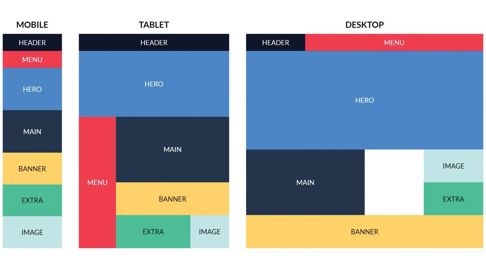

# CSS Layout

How do we control where elements sits on a webpage and how do we make these pages attractive?

It is done hrough css layout and styling. Let explain.  A webpage design can be either fixed width of liquid in its layout. What his means is that the size does not change as the user increases or decreases the browser (fixed width). In a fluid layout the desigh stretches or shrinks as the user streches or shrinks the browser size. This works very well for mobil devices. Some websites can be hybrids.

Here is an example of a wireframe for a fixed and liquid and hybrid layouts.

Webpages are desiged acording to a grid. While grids can seem loke a restriction, it is the total opposite:

- They can create continuity between pages which may use different designs.
- They help the user to find informatio easily. 
- Makes it easier to add new content to the site in a consistent way.
- Helps people collaborate on the design of a site in a consistent way.

# Possible layout

960 px wide 12 column grid would look different on devices. Take a look at this example of what that means.

