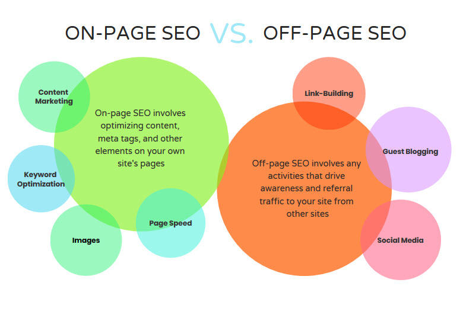

# Reading on Audio, Video and images

One of the challenges faced when working with responsive images has been managing each of the image variants, and deciding which image file to request depending pixel ratio and network connection.

**Chapter 16: “Images” (pp.406-427)**

Images play an important role in any webpage. Though it is not recommended to include a lot of images, but it is still important to use good images wherever required. CSS plays a good role to control image display. You can set the following image properties using CSS.

- The border property is used to set the width of an image border.
- The height property is used to set the height of an image.
- The width property is used to set the width of an image.
- The -moz-opacity property is used to set the opacity of an image.

**The Image Border Property**

- The border property of an image is used to set the width of an image border. This property can have a value in length or in %.
- width of zero pixels means no border.

Here's an example:

<html>
   <head>
   </head>

   <body>
      
       
      
   </body>
</html> 

**The Image Height Property**

The height property of an image is used to set the height of an image. This property can have a value in length or in %. While giving value in %, it applies it in respect of the box in which an image is available.

Here is an example −

<html>
   <head>
   </head>

   <body>
      
       
      
   </body>
</html>

**Chapter 19: “Practical Information” (476-492)**

***Search Enginer Optimization (SEO)***

when it comes to website accessability and user interfacing it is important to consider these seven steps to successful SEO:

* Crawl accessibility so engines can read your website
* Compelling content that answers the searcher’s query
* Keyword optimized to attract searchers & engines
* Great user experience including a fast load speed and compelling user experience
* Share-worthy content that earns links, citations, and amplification
* Title, URL, & description to draw high rankings
* Snippet/schema markup to stand out in SERPs

**Types of SEOs Techniques**

* On-page: Page Title, URL web address, headings, texts, link text, image ALT text, page description
* Off-Page: Getting other sites to link to you, words between the <a>tag</a>, linking word on pages.

