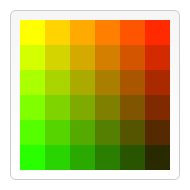

# Reading About Chart.js and Canvas

Chart.js is a community maintained open-source library (it’s available on GitHub) that helps you easily visualize data using JavaScript. It’s similar to Chartist and Google Charts. It supports 8 different chart types (including bars, lines, & pies), and they’re all responsive. In other words, you set up your chart once, and Chart.js will do the heavy-lifting for you and make sure that it’s always legible.

### The Charts.js API

All that is needed for the Charts.js API is the script included in your page along with a single <canvas> node to render the chart.

**General Configuration**

These are some general configuration options for the charts.

- ***Responsive*** - defines responsive chart options that apply to all charts.
- ***Device Pixel Ratio*** - defines the ratio between display pixels and rendered pixels.
- ***Interactions*** defines options that reflect how hovering chart elements works.
- ***Options*** -  scriptable and indexable options syntax.
- ***Colors*** - defines acceptable color values.
- ***Font*** - defines various font options.
- ***Performance*** - gives tips for performance-sensitive applications.

Chart.js can be used with ES6 modules, plain JavaScript and module loaders. Basically it is used for creating dynamic data driven charts for websites.

## The Canvas API
The Canvas API provides a means for drawing graphics via JavaScript and the HTML <canvas> element. It can also be used for animation, game graphics, data visualization, photo manipulation, and real-time video processing.

The Canvas API largely focuses on 2D graphics. The WebGL API, which also uses the <canvas> element, draws hardware-accelerated 2D and 3D graphics.

### Basic usage

At first sight a <canvas> looks like the  element, with the only clear difference being that it doesn't have the src and alt attributes. The element has only two attributes, width and height which are both optional and can also be set using DOM properties. When no width and height attributes are specified, the canvas will initially be 300px wide and 150px high. The element can be sized arbitrarily by CSS, but during rendering the image is scaled to fit its layout size: if the CSS sizing doesn't respect the ratio of the initial canvas, it will appear distorted.

### Drawing shapes with canvas
 <canvas> only supports two primitive shapes: rectangles and paths (lists of points connected by lines). All other shapes must be created by combining one or more paths. There are three functions that draw rectangles on the canvas:

- ***fillRect(x, y, width, height)*** - Draws a filled rectangle.
- ***strokeRect(x, y, width, height)*** - Draws a rectangular outline.
- ***clearRect(x, y, width, height)*** - Clears the specified rectangular area, making it fully transparent.

Here's and example of what that code looks like

function draw() {
  var canvas = document.getElementById('canvas');
  if (canvas.getContext) {
    var ctx = canvas.getContext('2d');
    ctx.fillRect(25, 25, 100, 100);
    ctx.clearRect(45, 45, 60, 60);
    ctx.strokeRect(50, 50, 50, 50);
  }
}

 

### Applying styles and colors

If we want to apply colors to a shape, there are two important properties we can use: fillStyle and strokeStyle.

- ***fillStyle = color*** - Sets the style used when filling shapes.
- ***strokeStyle = color*** - Sets the style for shapes' outlines.

Here's a sample code for this:

function draw() {
  var ctx = document.getElementById('canvas').getContext('2d');
  for (var i = 0; i < 6; i++) {
    for (var j = 0; j < 6; j++) {
      ctx.fillStyle = 'rgb(' + Math.floor(255 - 42.5 * i) + ', ' +
                       Math.floor(255 - 42.5 * j) + ', 0)';
      ctx.fillRect(j * 25, i * 25, 25, 25);
    }
  }
}

 

### Drawing text

There are two methods to render text:

- ***fillText(text, x, y [, maxWidth])*** - Fills a given text at the given (x,y) position. Optionally with a maximum width to draw.
- ***strokeText(text, x, y [, maxWidth])*** - Strokes a given text at the given (x,y) position. Optionally with a maximum width to draw.

Here's an example for that:

function draw() {
  var ctx = document.getElementById('canvas').getContext('2d');
  ctx.font = '48px serif';
  ctx.fillText('Hello world', 10, 50);
}

