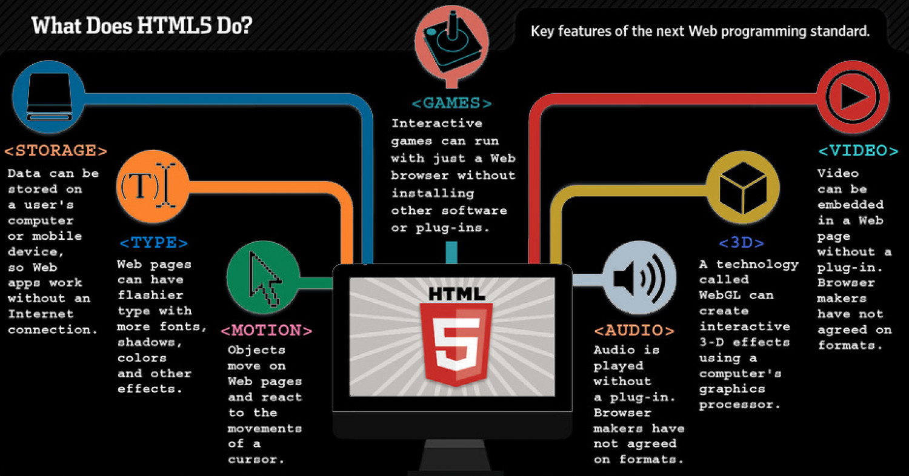

# “The Past, Present, and Future of Local Storage for Web Applications”

This is about the advantageous differences between local storage and web application storage. The differences being that local storage have options of storing informations in the following manner:
- The registry
- INI files
- XML files
- Embeded databases
- Own file format invention

Web applitions only option is to store data as cookies which have downsides:

- Cookies are included with every HTTP request, thereby slowing down your web application by needlessly transmitting the same data over and over
- Cookies are included with every HTTP request, thereby sending data unencrypted over the internet (unless your entire web application is served over SSL)
- Cookies are limited to about 4 KB of data — enough to slow down your application (see above), but not enough to be terribly useful

## Local storage before HTML5

Before HTML came about userData allows web pages to store up to 64 KB of data per domain. 

- Flash objects were created to store up to 100 KB of data per domain.
- Flash-to-JavaScript bridge called AMASS (AJAX Massive Storage System), was invented but it was limited by some of Flash’s design quirks. 
- By 2006 accessing LSOs from JavaScript became an order of magnitude easier and faster. 
- Flash gives each domain 100 KB of storage “for free.” Beyond that, it prompts the user for each order of magnitude increase in data storage (1 Mb, 10 Mb, and so on).

# Here's HTML5!!

# What is HTML5 storage?

It’s a way for web pages to store named key/value pairs locally, within the client web browser. Like cookies, this data persists even after you navigate away from the web site, close your browser tab, exit your browser, or what have you. HTML5 storage is more secure. Some refers to it as ***Local Storage*** or ***DOM Storage***. It does support the folowing browsers:

- IE 8.0+
- Firefox 3.5+
- Safari 4.0+
- Chrome 4.0+
- Opera 10.5+
- Iphone 2.0+
- Android 2.0+

## The future of HTML5

Currenly the future looks good for HTML5 but there is more to life than “5 megabytes of named key/value pairs,” and the future of persistent local storage and there are competing visions. One vision is SQL. In 2007, Google launched Gears, an open source cross-browser plugin which included an embedded database based on SQLite. This influenced the creation of the Web SQL Database. Web SQL Database (formerly known as “WebDB”) provides a thin wrapper around a SQL database, allowing you to store code from JavaScript.